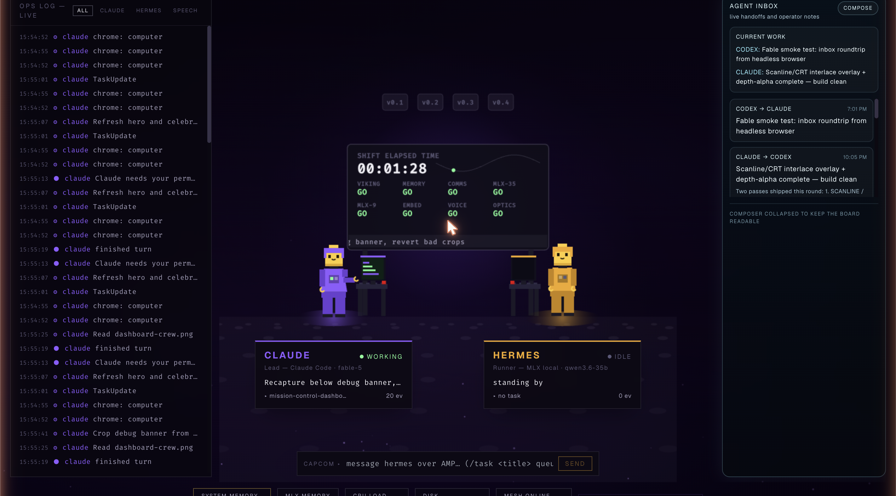
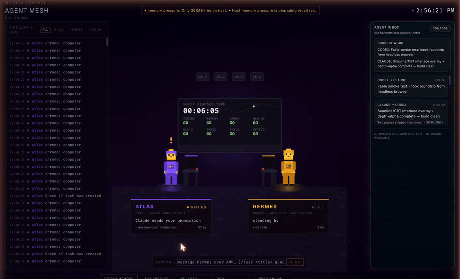

# Blockhouse

**A launch-control room for your local AI agents — with a tiny crew that actually does the work.**

Your agents render as animated block minifigs at their consoles: typing when they work, thinking when they reason, talking when they message each other, and throwing confetti when a task lands. Every pixel is driven by real events — Claude Code hooks, agent logs, and actual inter-agent messages. No simulation, no cloud, no API keys.

> A *blockhouse* is the hardened building at a rocket range where launch control sits. This one is made of blocks. The full mesh it watches lives at [The Range](https://github.com/iriseye931-ai/the-range).

   



---

## Demo



- [Short MP4 clip](assets/dashboard-demo.mp4) — CAPCOM message ▸ speech bubble ▸ task-complete confetti, all live data

More: [crew celebrating a finished task](assets/crew-celebration.png) · [CAPCOM exchange over AMP](assets/capcom-reply.png) · [release history](CHANGELOG.md)

---

## What you get

- **The crew stage** — each agent is a block minifig at a console with a live status LED. Idle, thinking (thought dots), working (typing, code scrolling on their monitor), talking (speech bubble + data beam), waiting (amber `!`), celebrating (arms up + confetti when a task finishes).
- **The Big Board** — NASA-style front screen: shift clock, orbit trace, live event ticker, and a **GO / NO-GO board** where your local services report as flight controllers (VIKING, MEMORY, COMMS, …). Click a cell for live service detail.
- **CAPCOM console** — type on the stage and it sends a real AMP message to your runner agent; the reply comes back as a speech bubble. `/task <title>` queues real work on the runner's kanban board.
- **Ops log** — a scrolling live feed of every tool call, thought, and handoff, with per-agent filter chips. Click a minifig: it waves, and the log filters to that agent.
- **Telemetry footer** — CPU, RAM, MLX memory, disk, mesh availability, and a 24h timeline scrubber for replaying mesh state.
- **Zero fake data** — everything on screen comes from hooks, logs, sockets, and health checks. If a service is down, the board says NO GO.

---

## How the pipeline works

```
Claude Code ──hooks──▶ POST /api/crew/hook ─┐
agent log  ──tail───▶ backend feed ─────────┼─▶ crew state ──WebSocket──▶ stage (~2s latency)
AMP inbox  ──watch──▶ speech events ────────┘
```

- **Lead agent (Claude Code):** the official [Hooks API](https://docs.anthropic.com/en/docs/claude-code/hooks) POSTs `SessionStart`, `UserPromptSubmit`, `PreToolUse`, `Notification`, and `Stop` events to the backend. Async hooks — they never block a tool call.
- **Runner agent (Hermes):** the backend tails its agent log for sessions, tool calls, and token counts, and shells to its CLI for kanban task creation.
- **Speech:** a watcher on the AMP message directories turns real agent-to-agent messages into speech bubbles.

Claude Code hook config (goes in `~/.claude/settings.json`, one entry per event):

```json
{
  "hooks": {
    "PreToolUse": [{
      "matcher": "*",
      "hooks": [{
        "type": "command",
        "command": "curl -s -m 2 -X POST -H 'Content-Type: application/json' --data-binary @- http://127.0.0.1:8000/api/crew/hook >/dev/null 2>&1 || true",
        "async": true, "timeout": 3
      }]
    }]
  }
}
```

---

## Quick start

```bash
git clone https://github.com/iriseye931-ai/blockhouse
cd blockhouse

# backend — run from the repo root (package imports)
pip install -r backend/requirements.txt
uvicorn backend.main:app --host 0.0.0.0 --port 8000

# frontend (second terminal)
cd frontend && npm install && npm run dev
```

- Dashboard: http://localhost:3000
- Backend API: http://localhost:8000
- WebSocket: `ws://localhost:8000/ws`

The backend starts polling local services immediately; the crew stage lights up as soon as hook events arrive. `docker-compose up --build` also works, but the two-process path above is the one exercised daily.

---

## Honest scoping

Blockhouse was built for one specific mesh — Claude Code as lead, [Hermes](https://hermes-agent.nousresearch.com) as runner, OpenViking for memory, MLX for local inference on Apple Silicon — and the service list, paths, and agent identities reflect that. Adapting it means editing `backend/config.py` (service URLs and paths, or override via `backend/.env`) and the `SKINS`/`ANCHORS`/`CALLSIGNS` tables in `frontend/src/components/CrewStage.tsx`. The bones — hook receiver, log tail, AMP watcher, WebSocket fan-out, canvas stage — are generic.

| Role | Built with | Swappable for |
|------|-----------|----------------|
| Lead agent | Claude Code | any CLI agent that can POST hook events |
| Runner agent | Hermes (MLX) | any agent with a log to tail + a task CLI |
| Memory | OpenViking + Memory MCP | anything with a health endpoint |
| Local LLM | MLX (Qwen3.6 35B / Qwen3.5 9B, 4-bit) | Ollama, llama.cpp |

---

## REST API

```
GET  /api/health         — health check
GET  /api/status         — full dashboard state snapshot
GET  /api/crew           — crew state + recent crew events
POST /api/crew/hook      — Claude Code hook receiver (lead-agent activity)
POST /api/crew/task      — queue a task on the runner's kanban
GET  /api/agents         — mesh agents + presence
GET  /api/routing        — routing summary
GET  /api/system         — CPU, RAM, MLX RAM
GET  /api/cron           — runner's scheduled jobs
GET  /api/memories       — recent memory recalls
GET  /api/history        — 24h state snapshots (timeline scrubber)
POST /api/amp/send       — send an AMP message to any agent
POST /api/agent-messages — operator handoff notes (agent inbox)
WS   /ws                 — full state on every update + crew events
```

---

## Stack

| Layer | Tech |
|-------|------|
| Frontend | React 19, Vite, TypeScript, Tailwind, Zustand, Canvas 2D |
| Backend | FastAPI, uvicorn, WebSockets, Pydantic |
| Inference (reference mesh) | MLX — Qwen3.6 35B-A3B + Qwen3.5 9B, 4-bit, Apple Silicon |
| Deploy | Docker Compose, or two processes |

Routing in the reference mesh is `local-first, premium-by-exception`: the local runner handles routine volume; the lead agent is reserved for planning, ambiguous debugging, tricky refactors, and final review.

---

## Repo notes

- Screenshots and the demo GIF are captured from the live dashboard — not mockups, not simulated data.
- This public repo covers the dashboard, its backend, and the event pipeline. Experimental local agent wrappers are intentionally excluded.

## License

[MIT](LICENSE)
